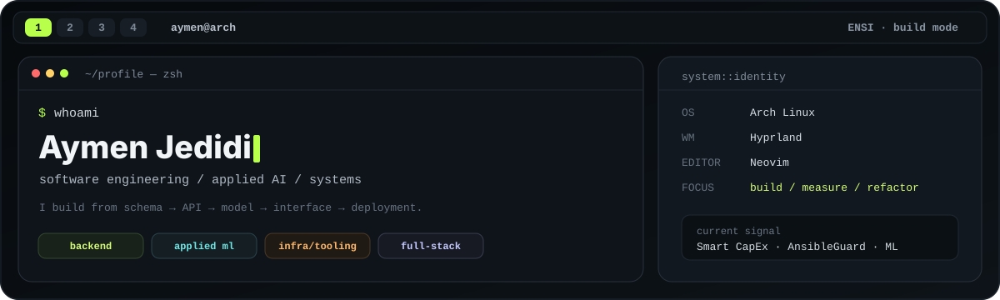
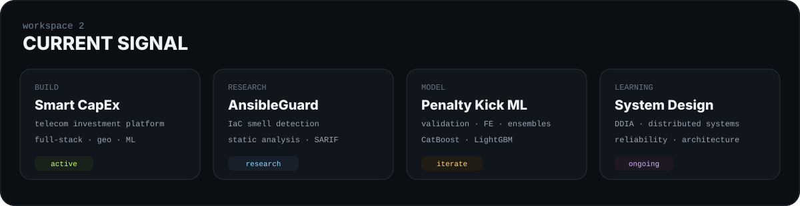
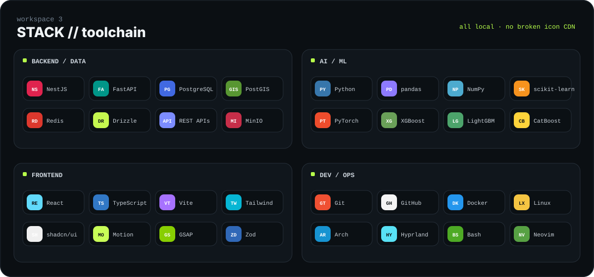
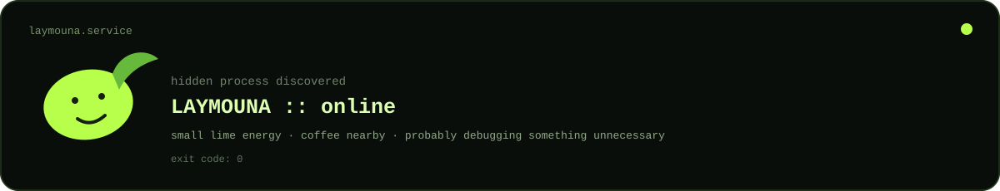

<p align="center">
  
</p>

<p align="center">
  <a href="#about"><code>01 / about</code></a>&nbsp;&nbsp;
  <a href="#work"><code>02 / work</code></a>&nbsp;&nbsp;
  <a href="#stack"><code>03 / stack</code></a>&nbsp;&nbsp;
  <a href="#learning"><code>04 / learning</code></a>&nbsp;&nbsp;
  <a href="#system"><code>05 / system</code></a>&nbsp;&nbsp;
  <a href="#contact"><code>06 / contact</code></a>
</p>

---

<a id="about"></a>
## 01 // about

Computer Science Engineering student at **ENSI**. I like building systems far enough end-to-end that I can understand the trade-offs instead of only touching one layer.

My strongest interests are **backend engineering**, **applied machine learning**, **developer tooling / static analysis**, **data-intensive systems**, and **full-stack product engineering**. I care about clean architecture, reproducible experiments, useful documentation, and knowing what is actually happening under the abstraction.

```text
location      :: Tunisia
current mode  :: build -> measure -> refactor
editor        :: Neovim
platform      :: Arch Linux / Hyprland
open to       :: international software engineering + AI opportunities
```

<p align="center">
  
</p>

<a id="work"></a>
## 02 // selected work

<table>
<tr>
<td width="50%" valign="top">
  <a href="https://github.com/JedidiAymen/Smart-Capex"><strong>Smart CapEx</strong></a><br><br>
  Telecom investment decision platform connecting data ingestion, network pressure, forecasts, candidate interventions, optimized portfolios, technical review, finance validation, and committee approval.<br><br>
  <code>React</code> <code>TypeScript</code> <code>NestJS</code> <code>FastAPI</code><br>
  <code>PostgreSQL/PostGIS</code> <code>Redis</code> <code>Drizzle</code> <code>Docker</code><br><br>
  <a href="https://github.com/JedidiAymen/Smart-Capex">open repository -></a>
</td>
<td width="50%" valign="top">
  <a href="https://github.com/JedidiAymen/ai-smart-checkout"><strong>AI Smart Checkout</strong></a><br><br>
  ML-driven checkout optimization around fraud risk, customer trust, payment friction, abandonment prediction, routing decisions, and an AI shopping assistant.<br><br>
  <code>Python</code> <code>Machine Learning</code> <code>FastAPI</code> <code>React</code><br>
  <code>XGBoost</code> <code>PostgreSQL</code> <code>CrewAI</code><br><br>
  <a href="https://github.com/JedidiAymen/ai-smart-checkout">open repository -></a>
</td>
</tr>
<tr>
<td width="50%" valign="top">
  <a href="https://github.com/JedidiAymen/ansibleguard-sarif-validation"><strong>AnsibleGuard / IaC research</strong></a><br><br>
  Static-analysis work for Ansible and Infrastructure as Code, focused on smell detection, research validation, quality rules, and SARIF-compatible output.<br><br>
  <code>Python</code> <code>Ansible</code> <code>Static Analysis</code> <code>IaC</code> <code>SARIF</code><br><br>
  <a href="https://github.com/JedidiAymen/ansibleguard-sarif-validation">open public validation repo -></a>
</td>
<td width="50%" valign="top">
  <a href="https://github.com/JedidiAymen/GODS-5.0-website"><strong>GODS 5.0</strong></a><br><br>
  Interactive website for IEEE ENSI Student Branch's data-science hackathon, with registration flows, event content, motion-heavy sections, and animated interactions.<br><br>
  <code>React</code> <code>TypeScript</code> <code>Tailwind</code> <code>GSAP</code> <code>Motion</code> <code>Zod</code><br><br>
  <a href="https://github.com/JedidiAymen/GODS-5.0-website">open repository -></a>
</td>
</tr>
</table>

<details>
<summary><strong>more project signal</strong> — what I am also working on</summary>
<br>

- **Penalty-kick outcome prediction** — leakage-safe validation, feature engineering, CatBoost / LightGBM families, calibration, and ensembling.
- **Portfolio** — a software-engineer-first portfolio built with React, TypeScript, Tailwind, shadcn/ui, GSAP, and Motion.
- **Linux workflow** — maintaining and refining a keyboard-driven Arch / Hyprland / Neovim environment.
- **System design practice** — backend boundaries, caching, queues, databases, reliability, observability, and deployment trade-offs.

</details>

<a id="stack"></a>
## 03 // stack

<p align="center">
  
</p>

<details>
<summary><strong>expand full toolchain</strong></summary>
<br>

**Languages & foundations**  
Python · TypeScript · JavaScript · C · C++ · SQL · PL/SQL · Bash

**Backend & data**  
NestJS · FastAPI · REST APIs · PostgreSQL · PostGIS · Redis · Drizzle ORM · MinIO

**AI / ML**  
pandas · NumPy · scikit-learn · PyTorch · XGBoost · LightGBM · CatBoost · probability calibration · feature engineering · model evaluation

**Frontend**  
React · Vite · Tailwind CSS · shadcn/ui · Motion · GSAP · Zod

**Infrastructure / engineering workflow**  
Docker · Docker Compose · Git · GitHub · Ansible · SARIF · Linux · Arch Linux · Hyprland · Neovim · technical documentation · testing

</details>

<a id="learning"></a>
## 04 // research & learning

<table>
<tr>
<td width="50%" valign="top">
<strong>Currently reading</strong><br><br>
Designing Data-Intensive Applications<br>
System Design Interview — Vol. 1<br>
System Design Interview — Vol. 2
</td>
<td width="50%" valign="top">
<strong>Current depth areas</strong><br><br>
Static analysis / software quality<br>
Infrastructure as Code research<br>
Applied tabular ML<br>
Backend architecture / system design<br>
Reliable data-intensive applications
</td>
</tr>
</table>

I am deliberately trying to connect the layers: not just training a model, but understanding the data contract and serving path; not just building an API, but understanding persistence, caching, failure modes, observability, and deployment.

<a id="system"></a>
## 05 // system

```bash
$ fastfetch --profile
OS        Arch Linux
WM        Hyprland
Editor    Neovim / LazyVim
CLI       Bash + Git
Containers Docker / Docker Compose
Mindset   keyboard-first, reproducible, documented

$ cat engineering.preferences
small interfaces > hidden magic
measured experiments > random tuning
clear architecture > framework worship
working product > pretty diagram only
```

<details>
<summary><strong>why the Linux / Hyprland theme?</strong></summary>
<br>

It is not decoration only. My normal development setup is Linux-centric and keyboard-driven, so the profile is designed like a small workspace rather than a generic list of badges. The lime accent is the visual thread; the rest stays restrained so the projects remain the focus.

</details>

<a id="contact"></a>
## 06 // contact

<table>
<tr>
<td><strong>Email</strong></td>
<td><a href="mailto:aymen.jedidi@ensi-uma.tn">aymen.jedidi@ensi-uma.tn</a></td>
</tr>
<tr>
<td><strong>GitHub</strong></td>
<td><a href="https://github.com/JedidiAymen">@JedidiAymen</a></td>
</tr>
<tr>
<td><strong>Portfolio</strong></td>
<td><a href="https://github.com/JedidiAymen/Portfolio">JedidiAymen/Portfolio</a></td>
</tr>
<tr>
<td><strong>Availability</strong></td>
<td>International software engineering / AI internships and opportunities</td>
</tr>
</table>

---

<details>
<summary><code>laymouna.service</code> — hidden process</summary>
<br>
<p align="center">
  
</p>
</details>

<p align="center"><sub>build carefully · measure what matters · keep the terminal clean</sub></p>